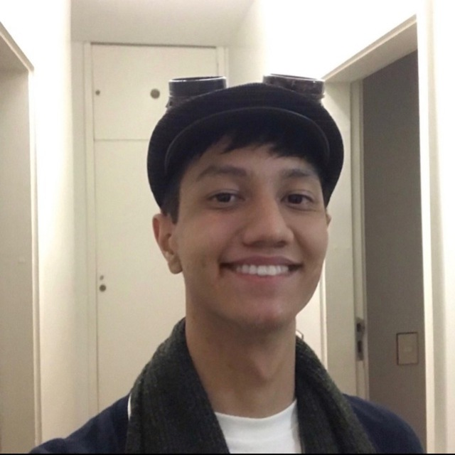

# SINDPOL 2024.1

Este é o repositório de documentação do projeto SINDPOL das disciplinas de EPS e MDS no primeiro semestre de 2024. 

## Repositórios do projeto

- [Documentação](https://github.com/fga-eps-mds/2024.1-SINDPOL-DOC)
- [Frontend](https://github.com/fga-eps-mds/2024.1-SINDPOL-Front)

## Integrantes do time

### EPS

|                                                                              | Nome               | Matrícula | Usuário Github                                                             |
| - | - | - | - |
|     | Sara Campos       | 170045269 | [@saracampss](https://github.com/saracampss) |
|     | Alvaro Gouvea       | 180012002 | [@algouvea](https://github.com/algouvea) |
|     | Ingrid Carvalho       | 190029731 | [@ingridscarvalho](https://github.com/ingridscarvalho) |
|     | Victor Yukio       | 180068229 | [@yukioz](https://github.com/yukioz) |

### MDS

|                                                                              | Nome               | Matrícula | Usuário Github                                                             |
| - | - | - | - |
|     | Anna Brandão       | 222006534 | [@annacbrandao](https://github.com/annacbrandao) |
|     | Diogo Barboza       | 222006660 | [@Diogo-Barboza](https://github.com/Diogo-Barboza) |
|     | Davi Mesquita       | 222006650 | [@davimesquit](https://github.com/davimesquit) |
|     | Davi Nobre       | 211062929 | [@jagaima](https://github.com/jagaima) |
|     | Guilherme Storch       | 211030765 | [@storch7](https://github.com/storch7) |
|     | Milena Rocha       | 222022000 | [@milenafrocha](https://github.com/milenafrocha) |
|     | João Victor Nobre       | 202017423 | [@Gam13](https://github.com/Gam13) |
|     | José Eduardo       | 221008202 | [@jevprado](https://github.com/jevprado) |

## Histórico de versão

| Alteração | Data | Autor | 
| - | - | - |
| Criação do documento | 26/03/24 | Sara Campos |
| Correções | 28/03/24 | Sara Campos |