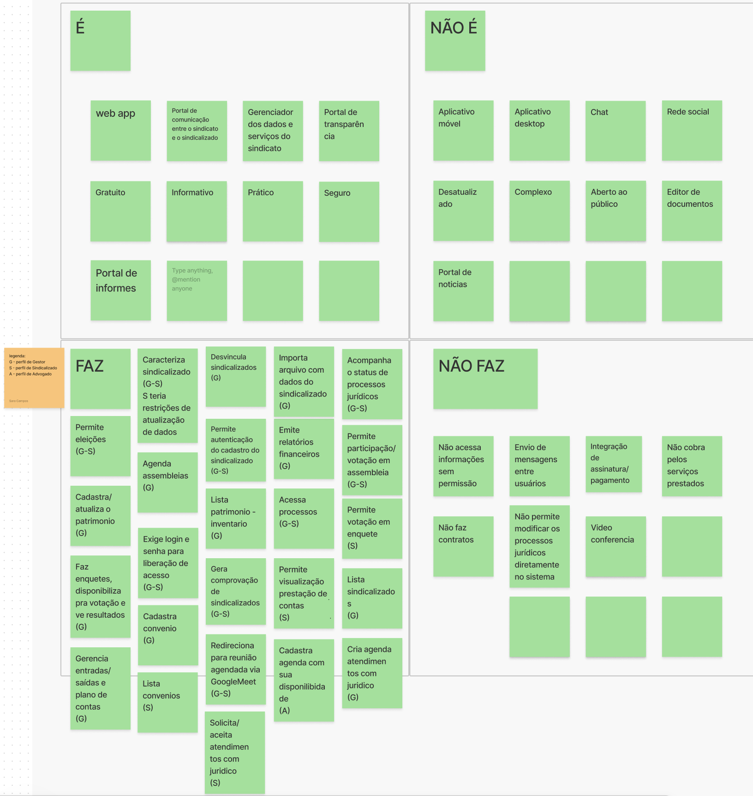

# Lean Inception - Dia 2

## É/Nãoé - Faz/NãoFaz (ENFN)

Nesta atividade, busca-se classificar o produto seguindo quatro diretrizes. O ENFN ajuda a esclarecer o produto através de uma dinâmica simples onde define-se: o que o produto **é**; o que o produto **não é**; o que o produto **faz**; e o que o produto **não faz**.

## Reunião com o cliente 

**Data**: 02/04/24

**Participantes**:

| Equipe | Nomes | 
| - | - |
| PO | Matheus Amaral, Davi Mendonça |
| EPS | Ingrid Carvalho, Sara Campos | 
| MDS | José Eduardo, Diogo Barboza, Davi Nobre  | 

**Descrição**:

Nesta reunião, a dinâmica de ENFN foi novamente apresentada para o cliente e guiada pela estudante Ingrid Carvalho, ao passo que a estudante Sara Campos fazia as anotações no quadro Figma como pode ser observado [aqui](https://www.figma.com/file/N0dSL6DZVPR7wI7zG9xKnI/Visao-do-Produto-2024.1?type=whiteboard&node-id=0%3A1&t=mNj66yKKZVPilcfj-1). 

É importante ressaltar que nessa data, o quadro ENFN foi retomado após um [teste de usabilidade](../prototipagem/testesusabilidade.md) realizado com o protótipo 2023/2. As estudantes EPS presentes chegaram a conclusão de que a combinação do teste, onde navegou-se por uma versão do sistema juntamente com o PO Davi Mendonça, seguido pela ENFN ajudou bastante no esclarecimento do produto para os estudantes, assim como refrescou bastante a memória dos POs presentes que conseguiram trazer com facilidade várias características do produto para o quadro ENFN (especialmente na seção "Faz"). 

Como resultado dessa reunião, chegou-se ao seguinte quadro ENFN: 

## Referências

Lean Inception: Como alinhar pessoas e construir o produto certo. Caroli, Paulo.

## Histórico de versão

| Alteração | Data | Autor | 
| - | - | - |
| Criação do documento | 08/04/24 | Sara Campos |