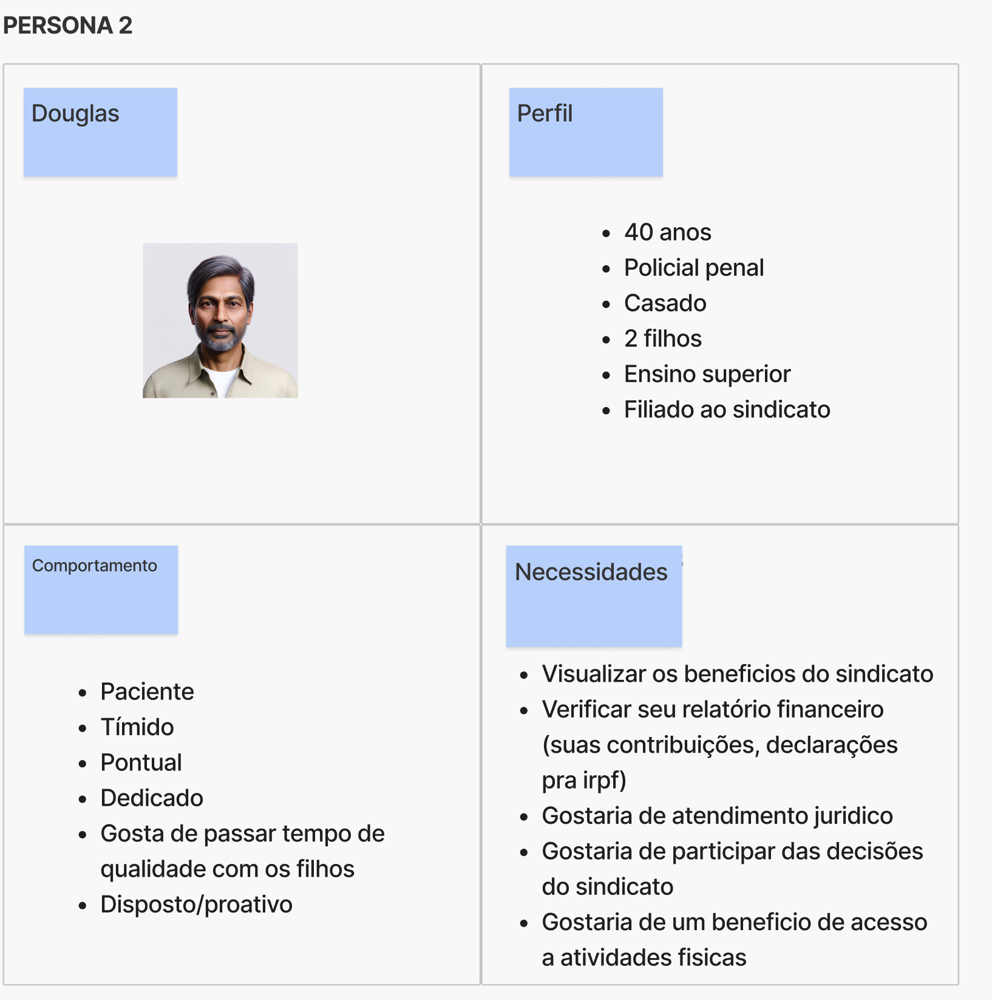
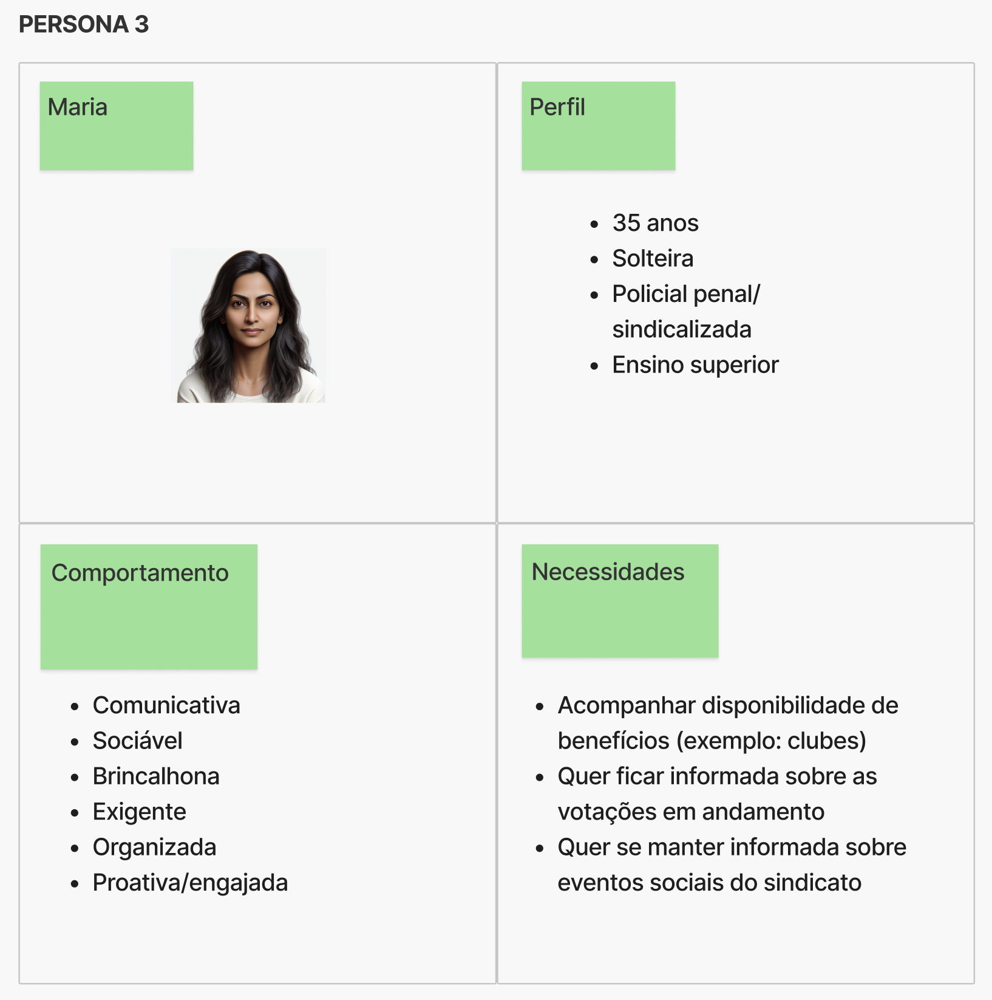
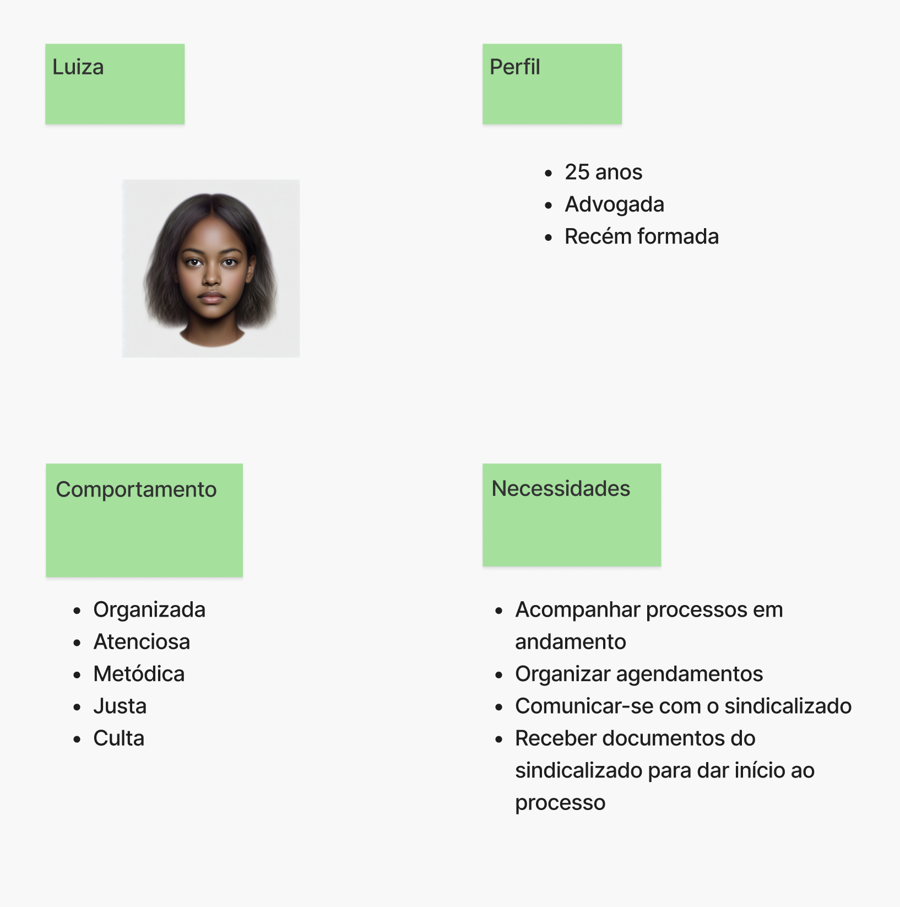

# Lean Inception - Dia 3 

## Objetivos do Produto 

Nesse momento, a proposta é resumir o produto em seus objetivos. Assim, as funções esperadas que o produto execute são trazidas e clusterizadas. 

## Personas 

As personas são representações dos usuários finais do produto e trazem de forma mais realista quais necessidades aquele produto se propõe a atender. Assim, o time consegue levantar as funcionalidades tendo em mente a pessoa que irá usar o sistema. 

## Reunião 

**Data**: 08/04/24

**Participantes**:

| Equipe | Nomes | 
| - | - |
| PO | Matheus Amaral, Davi Mendonça |
| EPS | Ingrid Carvalho, Sara Campos, Alvaro Gouvea | 
| MDS | Anna Brandão, Guilherme Storch, Milena Rocha, José Eduardo, Diogo Barboza, Davi Mesquita, Davi Nobre, João Victor Nobre  | 

**Descrição**:

Em reunião, a dinâmica de Visão do Produto foi apresentada para o cliente e guiada pela estudante Sara Campos, ao passo que a estudante Ingrid Carvalho fazia as anotações no quadro Figma como pode ser observado [aqui](https://www.figma.com/file/N0dSL6DZVPR7wI7zG9xKnI/Visao-do-Produto-2024.1?type=whiteboard&node-id=0%3A1&t=mNj66yKKZVPilcfj-1). 

Neste encontro, iniciamos com os Objetivos do Produto que haviam sido levantados no semestre 2023/2, refinando os textos dos post-its, excluindo duplicatas, especificando os perfis de usuário em cada post-it, aglutinando clusters e adicionando um novo cluster que foi trazido pelos POs. Além disso, com os clusters validados, foi pedido ao PO Davi Mendonça que classificasse cada um por prioridade/urgência indo de 1 a 7. Dessa forma, chegou-se nesta reunião ao seguinte resultado: 

>> Os Objetivos do Produto ainda devem ser revisados em comparação com o ENFN, a fim de garantir que nenhum objetivo/função levantado anteriormente tenha sido esquecido na fase anterior.

Em seguida, duas personas construídas no semestre 2023/2 foram refinadas e duas novas personas foram criadas. Como pode-se observar abaixo, foram validadas 1 persona Gestor, 2 personas Sindicalizados  e 1 persona Advogada:

>> Como tem-se observado que o perfil de maior urgência é o de Gestor, outra persona Gestor deve ser construída e enviada para validação do cliente.

Foi observado também nessa reunião que há necessidade de maior participação por parte dos estudantes de MDS. Assim, para incentivar essa colaboração, os MDS foram divididos em dois times pra cuidar de algumas demandas. 

| Time | Responsável por guiar | Participantes | Demanda | 
| - | - | - | - |
| 1 | Diogo Barboza | Anna Brandão, José Eduardo, João Victor Nobre | Melhorar a persona gestor, criar outra persona gestor (especificar melhor as necessidades dessas 2 personas) e fazer as jornadas de usuário de cada um |
| 2 | Guilherme Storch | Davi Nobre, Milena Rocha, Davi Mesquita | Conferir se tudo que está no ENFN está representado no objetivos do produto e, se não estiver, adicionar em seu respectivo cluster; Jornadas das personas sindicalizadas e advogada |

A ideia é incentivar a colaboração entre os MDS que ainda não tiveram oportunidade de trabalhar juntos e aumentar a contribuição e o alinhamento do time, de forma que, os MDS se sintam mais incluídos e seguros em participar da reunião com o cliente.

As atividades que foram pedidas deles devem ser acompanhadas pelos estudantes EPS disponíveis em caso de dúvida, e revisadas antes de serem enviadas para validação do cliente. 

## Referências

Lean Inception: Como alinhar pessoas e construir o produto certo. Caroli, Paulo.

## Histórico de versão

| Alteração | Data | Autor | 
| - | - | - |
| Criação do documento | 09/04/24 | Sara Campos |